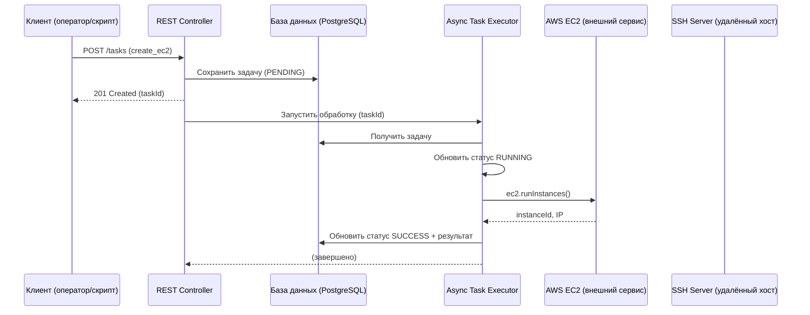

## Техническое задание (ТЗ) на проект «Cloud Support Automation API»
**Версия:** 1.0  
**Дата:** 3 марта 2026 г.  
**Автор:** [Ваше имя]

### 1. Общее описание
**Название проекта:** Cloud Support Automation API  
**Цель:** Создать микросервис на Spring Boot 3.5 (Java 21, Gradle), автоматизирующий выполнение рутинных запросов технической поддержки по облачным продуктам. Микросервис предоставляет REST API для асинхронного выполнения задач, таких как создание виртуальных машин (IaaS), выполнение команд на удалённых Linux-серверах, с возможностью лёгкого расширения на новые типы задач (S3, DBaaS, Kubernetes).

**Ключевые возможности (MVP за 1 день):**
- Приём задачи на создание EC2-инстанса в AWS.
- Приём задачи на выполнение SSH-команды на удалённом Linux-сервере.
- Асинхронная обработка задач (без блокировки ответа).
- Хранение истории задач и результатов в PostgreSQL.
- Документирование API через Swagger (OpenAPI).
- Контейнеризация приложения и базы данных (Docker Compose).

---

### 2. Бизнес-логика и пользовательские сценарии

#### Сценарий 1: Автоматизация создания виртуальной машины (IaaS)
- **Дано (вход):** Техподдержка получает тикет: «Создайте VM с Ubuntu 20.04, 2 vCPU, 4 GB RAM, ключом mykey».
- **Действие:** Оператор (или скрипт) отправляет POST-запрос к API с параметрами образа, типа инстанса, ключа.
- **Результат (выход):** API возвращает ID задачи. Фоновый процесс создаёт EC2-инстанс через AWS SDK. После завершения результат (instanceId, public IP) сохраняется в БД и доступен по GET.

#### Сценарий 2: Выполнение произвольной команды на сервере (Linux)
- **Дано (вход):** Тикет: «Проверьте свободное место на сервере 10.0.0.1».
- **Действие:** API принимает параметры: host, port, credentials, команда (например, `df -h`).
- **Результат (выход):** Фоновый процесс подключается по SSH, выполняет команду, возвращает stdout/stderr и код возврата.

---

### 3. Спецификация REST API

**Базовый URL:** `/api/v1`

#### 3.1 Создание задачи
```
POST /tasks
Content-Type: application/json

{
  "type": "create_ec2",               // или "ssh_command"
  "parameters": {
    // специфичные для типа поля
  }
}
```
**Ответ:**
```
201 Created
Location: /api/v1/tasks/{id}
{
  "taskId": 42,
  "status": "PENDING"
}
```

#### 3.2 Получение статуса и результата задачи
```
GET /tasks/{id}
```
**Ответ:**
```json
{
  "id": 42,
  "type": "create_ec2",
  "status": "SUCCESS",                // PENDING, RUNNING, SUCCESS, FAILED
  "parameters": { ... },
  "result": {
    "instanceId": "i-12345",
    "publicIp": "54.123.45.67"
  },
  "errorMessage": null,
  "createdAt": "2026-03-03T10:00:00Z",
  "updatedAt": "2026-03-03T10:00:05Z",
  "completedAt": "2026-03-03T10:00:05Z"
}
```

#### 3.3 Список задач (с пагинацией)
```
GET /tasks?page=0&size=20
```
**Ответ:** массив задач (как выше) + метаданные пагинации.

#### 3.4 Документация Swagger
Доступна по `/swagger-ui.html` (после запуска).

---

### 4. Схема базы данных

**Таблица `tasks`** (PostgreSQL)

| Поле          | Тип                        | Описание                               |
|---------------|----------------------------|----------------------------------------|
| id            | BIGSERIAL PRIMARY KEY      | Уникальный идентификатор задачи        |
| type          | VARCHAR(50) NOT NULL       | Тип задачи (create_ec2, ssh_command)   |
| parameters    | JSONB NOT NULL             | Параметры задачи                        |
| status        | VARCHAR(20) NOT NULL       | PENDING, RUNNING, SUCCESS, FAILED      |
| result        | JSONB                      | Результат выполнения (если успешно)     |
| error_message | TEXT                       | Сообщение об ошибке (если FAILED)       |
| created_at    | TIMESTAMP WITH TIME ZONE DEFAULT NOW() | Время создания           |
| updated_at    | TIMESTAMP WITH TIME ZONE   | Время последнего изменения              |
| completed_at  | TIMESTAMP WITH TIME ZONE   | Время завершения                        |

**Таблица `audit_log`** (рекомендуется)

| Поле       | Тип                        | Описание                          |
|------------|----------------------------|-----------------------------------|
| id         | BIGSERIAL PRIMARY KEY      |                                   |
| task_id    | BIGINT REFERENCES tasks(id)| Ссылка на задачу                  |
| event      | VARCHAR(50)                | created, started, completed, failed |
| details    | JSONB                      | Доп. информация (например, кто вызвал) |
| timestamp  | TIMESTAMP WITH TIME ZONE DEFAULT NOW() | Время события         |

---

### 5. Архитектура системы

**Диаграмма взаимодействия (Mermaid):**



Для SSH-команд аналогично, только вместо AWS – вызов JSch.

#### Описание компонентов (сервисов) системы:

- **Клиент (Client)** – внешний пользователь или автоматизированная система (например, скрипт, интеграция с тикет-системой), отправляющая HTTP-запросы к API.
- **REST Controller** – слой представления Spring MVC, принимающий запросы, валидирующий входные данные, создающий запись задачи в БД и инициирующий асинхронную обработку.
- **База данных (PostgreSQL)** – хранилище задач и аудита. Используется для сохранения параметров, статусов и результатов выполнения.
- **Async Task Executor** – компонент Spring (`@Async` с настроенным пулом потоков), отвечающий за фоновое выполнение задач. Он извлекает задачу из БД, обновляет статус, вызывает соответствующий процессор и сохраняет результат.
- **AWS EC2 (внешний сервис)** – облачный API AWS, используемый для создания виртуальных машин. Взаимодействие через AWS SDK for Java.
- **SSH Server (удалённый хост)** – целевой Linux-сервер, на котором выполняется команда. Доступ через библиотеку JSch.

**Внутренние компоненты (Spring-сервисы):**
- **TaskService** – оркестрирует операции с задачами: создание, получение по ID, пагинация.
- **TaskProcessor** – интерфейс, реализуемый для каждого типа задач (`CreateEc2Processor`, `SshCommandProcessor`). Содержит логику выполнения.
- **AuditService** – сервис для логирования событий в таблицу аудита (опционально).

---

### 6. Технологический стек и зависимости (Spring Initializr)

- **Java:** 21
- **Spring Boot:** 3.5.x
- **Система сборки:** Gradle (Kotlin DSL или Groovy – на выбор)
- **Зависимости (Gradle - пример):**
  ```groovy
  implementation 'org.springframework.boot:spring-boot-starter-web'
  implementation 'org.springframework.boot:spring-boot-starter-data-jpa'
  implementation 'org.springframework.boot:spring-boot-starter-validation'
  implementation 'org.springframework.boot:spring-boot-starter-actuator'
  implementation 'org.springdoc:springdoc-openapi-starter-webmvc-ui:2.8.0'
  implementation 'software.amazon.awssdk:ec2:2.29.0'
  implementation 'com.jcraft:jsch:0.1.55'
  runtimeOnly 'org.postgresql:postgresql'
  compileOnly 'org.projectlombok:lombok'
  annotationProcessor 'org.projectlombok:lombok'
  testImplementation 'org.springframework.boot:spring-boot-starter-test'
  testImplementation 'org.testcontainers:postgresql:1.20.0'
  testImplementation 'org.testcontainers:localstack:1.20.0'
  testImplementation 'org.testcontainers:testcontainers:1.20.0'
  ```

- **Профили:** `dev` (H2 in-memory), `prod` (PostgreSQL).

---

### 7. План разработки на 1 день (9 часов)

| Этап | Время | Задачи |
|------|-------|--------|
| 1 | 0:00–1:00 | Создать проект через Spring Initializr (выбрать Gradle, Java 21, зависимости: Web, JPA, PostgreSQL, Validation, Lombok, Actuator). Настроить `application.yml` с профилями. Создать сущность `Task`, репозиторий. |
| 2 | 1:00–2:30 | Реализовать REST контроллеры: POST /tasks, GET /tasks/{id}, GET /tasks (пагинация). DTO, валидация. |
| 3 | 2:30–4:00 | Настроить асинхронное выполнение (`@EnableAsync`, `ThreadPoolTaskExecutor`). Создать интерфейс `TaskProcessor` и две заглушки. |
| 4 | 4:00–5:30 | Реализовать `CreateEc2Processor` с AWS SDK. Использовать реальный аккаунт или LocalStack для тестов. Обработка ошибок. |
| 5 | 5:30–7:00 | Реализовать `SshCommandProcessor` с JSch. Тестировать на локальной VM или контейнере с OpenSSH. |
| 6 | 7:00–8:00 | Добавить таблицу `audit_log` и логирование событий. Глобальный обработчик исключений (`@ControllerAdvice`). |
| 7 | 8:00–9:00 | Написать Dockerfile, `docker-compose.yml` (app + postgres). Подключить Swagger. Обновить README с инструкциями и примерами. |

---

### 8. Тестирование

- **Юнит-тесты:** для сервисов с fake-реализациями зависимостей (in-memory репозиторий, заглушки AWS и SSH).
- **Интеграционные тесты с Testcontainers:**
    - **PostgreSQL:** поднимается реальный контейнер с БД для проверки JPA-запросов.
    - **LocalStack:** эмуляция AWS EC2 для тестирования `CreateEc2Processor` без реального аккаунта.
    - **SSH-сервер:** контейнер с OpenSSH (например, `linuxserver/openssh-server`) для тестирования `SshCommandProcessor`.
- **Сквозные тесты:** `@SpringBootTest` с Testcontainers, проверяющие полный цикл API (создание задачи, ожидание завершения, проверка результата).

---

### 9. Примеры Raw Input / Output

#### Создание EC2 (успех)
**Запрос:**
```json
POST /api/v1/tasks
{
  "type": "create_ec2",
  "parameters": {
    "imageId": "ami-0c55b159cbfafe1f0",
    "instanceType": "t2.micro",
    "keyName": "my-key",
    "minCount": 1,
    "maxCount": 1,
    "securityGroupIds": ["sg-12345678"],
    "subnetId": "subnet-12345678"
  }
}
```
**Ответ (ID задачи):**
```json
{
  "taskId": 1,
  "status": "PENDING"
}
```
**Позже GET /tasks/1:**
```json
{
  "id": 1,
  "type": "create_ec2",
  "status": "SUCCESS",
  "parameters": { ... },
  "result": {
    "instanceId": "i-1234567890abcdef0",
    "publicIp": "54.123.45.67",
    "privateIp": "10.0.1.5"
  },
  "errorMessage": null,
  "createdAt": "2026-03-03T10:00:00Z",
  "updatedAt": "2026-03-03T10:00:05Z",
  "completedAt": "2026-03-03T10:00:05Z"
}
```

#### Выполнение SSH-команды (успех)
**Запрос:**
```json
POST /api/v1/tasks
{
  "type": "ssh_command",
  "parameters": {
    "host": "192.168.1.100",
    "port": 22,
    "username": "admin",
    "password": "secret",
    "command": "df -h"
  }
}
```
**Результат:**
```json
{
  "id": 2,
  "type": "ssh_command",
  "status": "SUCCESS",
  "parameters": { ... },
  "result": {
    "exitCode": 0,
    "stdout": "Filesystem      Size  Used Avail Use% Mounted on\n/dev/root        20G   15G  4.5G  77% /",
    "stderr": ""
  },
  "errorMessage": null
}
```

#### Ошибка (неверный ключ)
```json
{
  "id": 3,
  "type": "create_ec2",
  "status": "FAILED",
  "parameters": { ... },
  "result": null,
  "errorMessage": "Invalid keyPair 'my-key' does not exist"
}
```

---

### 10. Развёртывание (Docker)

**Dockerfile:**
```dockerfile
FROM gradle:8.10-jdk21 AS build
WORKDIR /app
COPY build.gradle settings.gradle ./
COPY src src
RUN gradle bootJar --no-daemon

FROM openjdk:21-jdk-slim
WORKDIR /app
COPY --from=build /app/build/libs/*.jar app.jar
EXPOSE 8080
ENTRYPOINT ["java", "-jar", "app.jar"]
```

**docker-compose.yml:**
```yaml
version: '3.8'
services:
  postgres:
    image: postgres:15
    environment:
      POSTGRES_DB: support_automation
      POSTGRES_USER: user
      POSTGRES_PASSWORD: pass
    ports:
      - "5432:5432"
    volumes:
      - postgres_data:/var/lib/postgresql/data
    networks:
      - backend

  app:
    build: .
    environment:
      SPRING_PROFILES_ACTIVE: prod
      SPRING_DATASOURCE_URL: jdbc:postgresql://postgres:5432/support_automation
      SPRING_DATASOURCE_USERNAME: user
      SPRING_DATASOURCE_PASSWORD: pass
    ports:
      - "8080:8080"
    depends_on:
      - postgres
    networks:
      - backend

volumes:
  postgres_data:

networks:
  backend:
```

---

### 11. Критерии готовности (Definition of Done)
- [x] Реализованы два типа задач: `create_ec2` и `ssh_command`.
- [x] api соответствует спецификации (crud задач, пагинация).
- [x] Асинхронная обработка работает (задачи выполняются в фоне).
- [x] Данные сохраняются в PostgreSQL.
- [x] Написаны интеграционные тесты с Testcontainers для обоих процессоров.
- [x] Документация Swagger доступна по `/swagger-ui.html`.
- [x] Проект собирается в Docker-образ и запускается через `docker-compose up`.
- [x] README содержит примеры запросов и инструкцию по запуску.

---

### 12. Возможные расширения (после MVP)
- Добавить аутентификацию (API keys, JWT).
- Поддержка других облачных провайдеров (Yandex.Cloud, GCP, Azure).
- Интеграция с тикет-системой (Zendesk, Jira) через вебхуки.
- Очереди сообщений (RabbitMQ/Kafka) для гарантированной доставки.
- Метрики и алерты (Prometheus, Grafana).
- Добавление процессоров для S3, DBaaS, Kubernetes.

---

### 13. Заключение
Данное ТЗ описывает минимально жизнеспособный продукт, который за один день разработки позволяет автоматизировать две наиболее частые задачи техподдержки облачных сервисов. Использование современного стека (Spring Boot 3.5, Java 21, Gradle, Testcontainers) гарантирует высокое качество кода и лёгкость дальнейшего расширения. Проект готов к демонстрации и может быть интегрирован в реальные рабочие процессы.