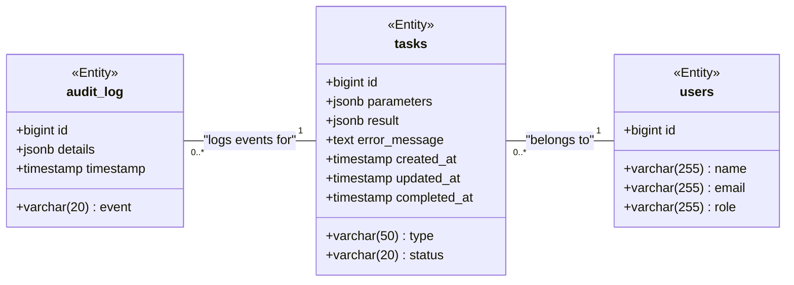

```mermaid
classDiagram
    direction LR

    class users {
        <<Entity>>
        +bigint id
        +varchar(255) name
        +varchar(255) email
        +varchar(255) role
    }

    class tasks {
        <<Entity>>
        +bigint id
        +varchar(50) type
        +jsonb parameters
        +varchar(20) status
        +jsonb result
        +text error_message
        +timestamp created_at
        +timestamp updated_at
        +timestamp completed_at
    }

    class audit_log {
        <<Entity>>
        +bigint id
        +varchar(20) event
        +jsonb details
        +timestamp timestamp
    }

    tasks "0..*" -- "1" users : "belongs to"
    audit_log "0..*" -- "1" tasks : "logs events for"
```
